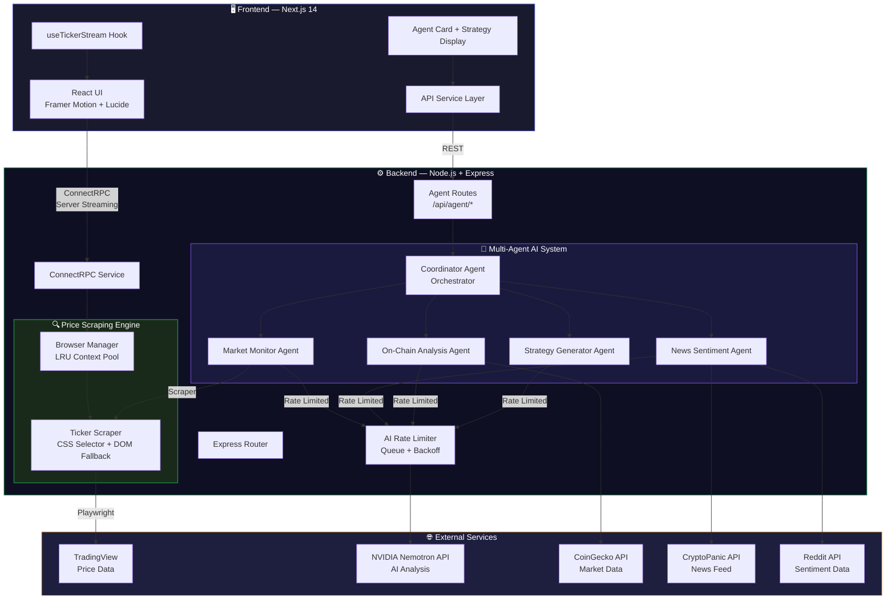
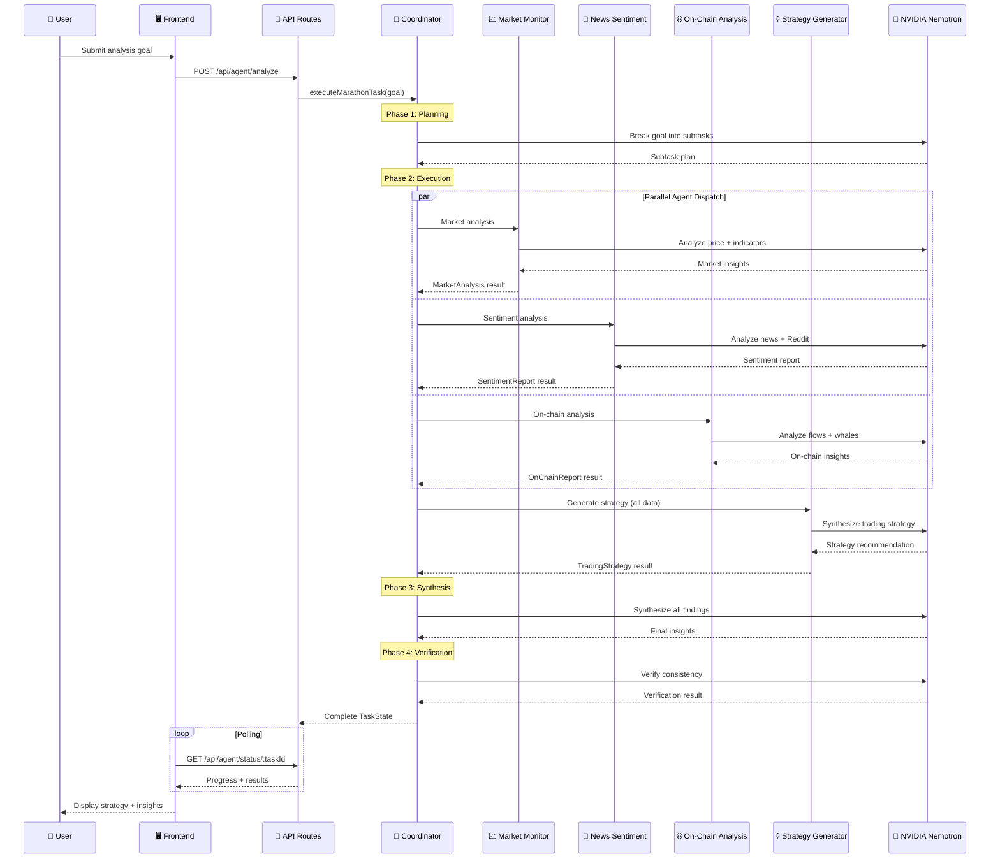
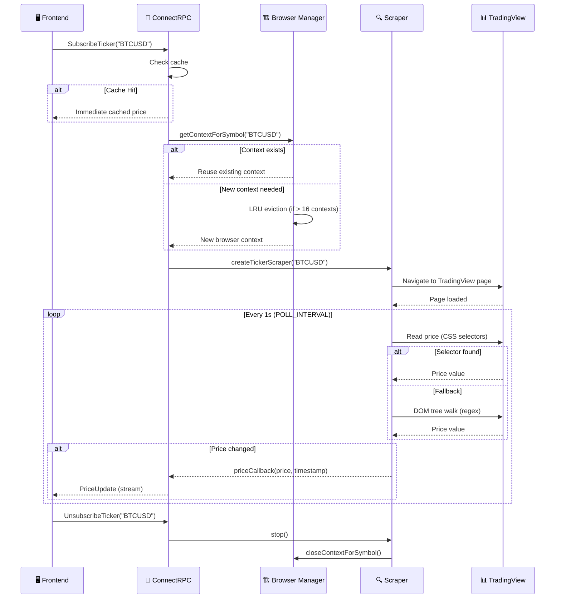
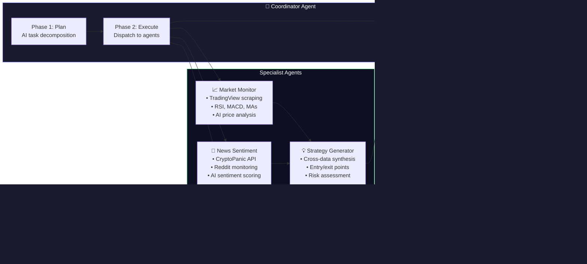

<div align="center">

# 🚀 Real-Time Crypto Stream

### AI-Powered Cryptocurrency Analysis & Real-Time Price Streaming Platform

[](https://www.typescriptlang.org/)
[](https://nextjs.org/)
[](https://nodejs.org/)
[](https://build.nvidia.com/)
[](https://playwright.dev/)
[](LICENSE)

A full-stack platform that combines **real-time cryptocurrency price streaming** via TradingView scraping with a **multi-agent AI analysis system** powered by NVIDIA Nemotron. Get live prices, market analysis, sentiment reports, on-chain intelligence, and AI-generated trading strategies — all in one place.

</div>

---

## 📐 System Architecture

### High-Level Overview



### Multi-Agent AI Pipeline



### Real-Time Price Streaming Flow



---

## 🚀 Key Features

| Feature | Description |
|---------|-------------|
| **⚡ Real-Time Streaming** | Live crypto prices via ConnectRPC server streaming from TradingView |
| **🤖 Multi-Agent AI** | 5 specialized AI agents orchestrated by a Coordinator for deep analysis |
| **📈 Market Monitoring** | Real-time price tracking with technical indicators (RSI, MACD, MAs) |
| **📰 Sentiment Analysis** | News + Reddit sentiment aggregation with AI-powered interpretation |
| **⛓️ On-Chain Intelligence** | Exchange flow tracking, whale movement detection, network metrics |
| **💡 Strategy Generation** | AI-synthesized trading strategies with entry/exit points and risk levels |
| **🎨 Modern UI** | Glass-morphism design, Framer Motion animations, dark/light mode |
| **🔄 Self-Correction** | Coordinator agent evaluates and adjusts plans mid-execution |
| **📊 Task Checkpointing** | Long-running analysis tasks with progress tracking and resumability |
| **🛡️ Rate Limiting** | Smart API queue with exponential backoff to prevent quota errors |

---

## 🛠️ Tech Stack

### Frontend
| Technology | Purpose |
|------------|---------|
| **Next.js 14** | React framework with SSR/SSG |
| **React 18** | Component UI with hooks |
| **ConnectRPC (Web)** | Type-safe server streaming |
| **Framer Motion** | Animations & transitions |
| **Recharts** | Data visualization charts |
| **Lucide React** | Icon library |

### Backend
| Technology | Purpose |
|------------|---------|
| **Node.js + Express** | HTTP server & routing |
| **ConnectRPC** | gRPC-like RPC framework |
| **Playwright** | Headless browser automation |
| **OpenAI SDK** | NVIDIA Nemotron integration |
| **Axios** | HTTP client for external APIs |
| **Cheerio** | HTML parsing for news scraping |

### Infrastructure
| Technology | Purpose |
|------------|---------|
| **Protocol Buffers** | Service/message definitions |
| **pnpm Workspaces** | Monorepo package management |
| **PostgreSQL** | Persistent data storage |
| **Redis** | Caching layer |
| **TypeScript** | End-to-end type safety |

---

## 📁 Project Structure

```
Real-Time-Crypto-Stream/
├── frontend/                          # Next.js 14 frontend
│   ├── src/
│   │   ├── components/
│   │   │   ├── AddTickerForm.tsx       # Ticker subscription form
│   │   │   ├── AgentCard.tsx           # AI agent task visualization
│   │   │   ├── StrategyDisplay.tsx     # Trading strategy results UI
│   │   │   ├── ThemeToggle.tsx         # Dark/light mode toggle
│   │   │   └── TickerList.tsx          # Live price ticker cards
│   │   ├── contexts/
│   │   │   └── ThemeContext.tsx         # Theme provider
│   │   ├── hooks/
│   │   │   └── useTickerStream.ts      # ConnectRPC streaming hook
│   │   ├── lib/
│   │   │   └── api.ts                  # REST API client
│   │   ├── pages/
│   │   │   ├── index.tsx               # Home — analysis launcher
│   │   │   └── analysis/
│   │   │       └── [taskId].tsx        # Live analysis dashboard
│   │   ├── styles/                     # Global CSS
│   │   └── types/
│   │       └── agent.types.ts          # Shared agent types
│   └── gen/proto/                      # Generated ConnectRPC stubs
│
├── backend/                            # Node.js backend server
│   ├── src/
│   │   ├── agents/
│   │   │   ├── CoordinatorAgent.ts     # 🧠 Orchestrator (planning, dispatch, synthesis, verification)
│   │   │   ├── MarketMonitorAgent.ts   # 📈 Price + technical analysis
│   │   │   ├── NewsSentimentAgent.ts   # 📰 News + Reddit sentiment
│   │   │   ├── OnChainAnalysisAgent.ts # ⛓️ Exchange flows + whale tracking
│   │   │   └── StrategyGeneratorAgent.ts # 💡 Trading strategy synthesis
│   │   ├── playwright/
│   │   │   ├── browserManager.ts       # Shared browser + LRU context pool
│   │   │   └── scraper.ts             # TradingView price scraper
│   │   ├── services/
│   │   │   └── connectRpcService.ts    # ConnectRPC streaming service
│   │   ├── routes/
│   │   │   └── agent.routes.ts         # REST API for agent system
│   │   ├── config/
│   │   │   └── constants.ts            # All configuration constants
│   │   ├── types/
│   │   │   └── agent.types.ts          # Agent type definitions
│   │   ├── utils/
│   │   │   └── rateLimiter.ts          # AI API rate limiter
│   │   ├── server.ts                   # Express + middleware setup
│   │   └── index.ts                    # Entry point + logging
│   └── gen/proto/                      # Generated ConnectRPC stubs
│
├── proto/
│   └── ticker.proto                    # Service & message definitions
├── shared/
│   └── types.ts                        # Shared TypeScript types
├── buf.gen.yaml                        # Protobuf code generation config
├── pnpm-workspace.yaml                 # Monorepo workspace config
└── package.json                        # Root workspace scripts
```

---

## 🤖 Agent System Deep Dive

### Agent Architecture



### Agent Capabilities

| Agent | Data Sources | AI Analysis | Output |
|-------|-------------|-------------|--------|
| **Coordinator** | All agent results | Task planning, synthesis, verification | `TaskState` with full results |
| **Market Monitor** | TradingView (Playwright) | Price trend + technical signals | `MarketAnalysis` |
| **News Sentiment** | CryptoPanic, Reddit | Bullish/bearish scoring + key events | `SentimentReport` |
| **On-Chain Analysis** | CoinGecko, simulated whale data | Exchange flow + whale pattern analysis | `OnChainReport` |
| **Strategy Generator** | All above agents' outputs | Entry/exit, stop-loss, risk level | `TradingStrategy` |

### Self-Correction Loop

The Coordinator implements a self-correction mechanism:
1. After subtask execution, it **evaluates progress** using AI
2. If the AI detects issues (data gaps, inconsistencies), it **adjusts the plan**
3. Failed subtasks are retried up to `MAX_SELF_CORRECTION_ATTEMPTS` (default: 3)
4. **Checkpoints** are saved at regular intervals for long-running tasks

---

## 🚀 Getting Started

### Prerequisites

- **Node.js** v18+
- **pnpm** package manager
- **NVIDIA API Key** — Get one at [build.nvidia.com](https://build.nvidia.com/)
- **Playwright browsers** installed

### Installation

```bash
# 1. Clone the repository
git clone <repository-url>
cd Real-Time-Crypto-Stream

# 2. Install dependencies
pnpm install --recursive

# 3. Install Playwright browsers
pnpm exec playwright install chromium

# 4. Generate protocol buffer code
buf generate

# 5. Configure environment variables
cp backend/.env.example backend/.env
# Edit backend/.env and add your NVIDIA_API_KEY
```

### Environment Variables

Create a `backend/.env` file:

```env
# Server
PORT=4000
HOST=localhost

# TradingView Scraping
POLL_INTERVAL=1000
PAGE_LOAD_TIMEOUT=30000
DEFAULT_EXCHANGE=BINANCE

# NVIDIA AI (Required for agent system)
NVIDIA_API_KEY=your_nvidia_api_key_here

# PostgreSQL (Optional)
POSTGRES_HOST=localhost
POSTGRES_PORT=5432
POSTGRES_DB=crypto_agent

# Redis (Optional)
REDIS_HOST=localhost
REDIS_PORT=6379

# Agent Configuration
MARATHON_TASK_MAX_DURATION_HOURS=24
MAX_SELF_CORRECTION_ATTEMPTS=3
```

### Running the Application

```bash
# Start both frontend and backend
pnpm start

# Or start individually:
pnpm --filter backend dev     # Backend on http://localhost:4000
pnpm --filter frontend dev    # Frontend on http://localhost:3000
```

### Verify Setup

| Endpoint | Purpose |
|----------|---------|
| `http://localhost:3000` | Frontend UI |
| `http://localhost:4000/health` | Backend health check |
| `http://localhost:4000/api/stats` | ConnectRPC stats |
| `http://localhost:4000/api/agent/test` | Agent system status |

---

## 🔌 API Reference

### Real-Time Streaming (ConnectRPC / Protobuf)

```protobuf
service TickerService {
  rpc SubscribeTicker (TickerRequest) returns (stream PriceUpdate);
  rpc UnsubscribeTicker (TickerRequest) returns (PriceUpdate);
}
```

### Agent REST API

| Method | Endpoint | Description | Body |
|--------|----------|-------------|------|
| `POST` | `/api/agent/analyze` | Start analysis task | `{ "goal": "Analyze Bitcoin..." }` |
| `GET` | `/api/agent/status/:taskId` | Get task progress | — |
| `GET` | `/api/agent/test` | Test NVIDIA connection | — |

<details>
<summary>Example: Start Analysis</summary>

```bash
curl -X POST http://localhost:4000/api/agent/analyze \
  -H "Content-Type: application/json" \
  -d '{"goal": "Analyze Bitcoin for trading opportunities with focus on current market trends"}'
```

**Response:**
```json
{
  "success": true,
  "taskId": "task-abc123",
  "status": "planning",
  "message": "Analysis task started",
  "subtasksPlanned": 4,
  "checkpoints": 0
}
```
</details>

<details>
<summary>Example: Check Status</summary>

```bash
curl http://localhost:4000/api/agent/status/task-abc123
```

**Response:**
```json
{
  "taskId": "task-abc123",
  "goal": "Analyze Bitcoin...",
  "status": "completed",
  "progress": { "completed": 4, "total": 4, "percentage": 100 },
  "currentAgent": "strategy_generator",
  "subtasks": [
    { "name": "Market Analysis", "status": "completed", "agentType": "market_monitor" },
    { "name": "Sentiment Check", "status": "completed", "agentType": "news_sentiment" },
    { "name": "On-Chain Review", "status": "completed", "agentType": "onchain_analysis" },
    { "name": "Strategy Gen", "status": "completed", "agentType": "strategy_generator" }
  ],
  "result": { "recommendation": "BUY", "confidence": 72, "..." : "..." }
}
```
</details>

---

## 🎯 Key Technical Decisions

### Why ConnectRPC over WebSockets?
- **Type-safe streaming** via Protocol Buffers — no manual serialization
- **HTTP/2 compatible** — works with standard infrastructure
- **Auto-generated client code** — frontend and backend always in sync

### Why Playwright over REST APIs?
- **No API key required** for TradingView price data
- **Full browser context** — handles JavaScript-rendered content
- **LRU browser context pool** — efficient resource sharing across symbols
- **Fallback DOM walking** — robust against CSS selector changes

### Why NVIDIA Nemotron?
- **High-quality reasoning** for financial analysis
- **OpenAI SDK compatible** — easy integration via `openai` npm package
- **Cost-effective** for high-frequency analysis tasks

### Why Multi-Agent Architecture?
- **Separation of concerns** — each agent is a domain expert
- **Parallel execution** — market, sentiment, and on-chain analysis run concurrently
- **Self-correction** — Coordinator can re-plan and retry on failures
- **Extensible** — add new agents without modifying existing ones

---

## 📊 Monitoring & Observability

- **Health Check**: `GET /health` — basic service status
- **Stats**: `GET /api/stats` — active connections, scrapers, client count
- **Structured Logging**: Run-specific log directories under `backend/logs/`
- **Agent Status**: Real-time task progress via polling API

---

## 🐳 Docker Deployment

```dockerfile
FROM node:18-alpine AS base
WORKDIR /app
RUN npm install -g pnpm
COPY package*.json pnpm-*.yaml ./
COPY backend/package.json backend/
COPY frontend/package.json frontend/
RUN pnpm install --recursive

FROM base AS build
COPY . .
RUN pnpm --filter frontend build
RUN pnpm --filter backend build

FROM node:18-alpine AS production
WORKDIR /app
COPY --from=build /app .
RUN npx playwright install-deps chromium
RUN npx playwright install chromium
EXPOSE 3000 4000
CMD ["pnpm", "start"]
```

---

## 🤝 Contributing

1. Fork the repository
2. Create a feature branch: `git checkout -b feature/your-feature`
3. Commit changes: `git commit -am 'Add your feature'`
4. Push to branch: `git push origin feature/your-feature`
5. Submit a pull request

---

## 📄 License

This project is open source and available under the [MIT License](LICENSE).

---

## 🙏 Acknowledgments

- **[TradingView](https://www.tradingview.com/)** — Real-time cryptocurrency price data
- **[NVIDIA NIM](https://build.nvidia.com/)** — Nemotron AI model for analysis
- **[Playwright](https://playwright.dev/)** — Reliable browser automation
- **[ConnectRPC](https://connectrpc.com/)** — Efficient real-time communication
- **[Next.js](https://nextjs.org/)** — Modern React framework