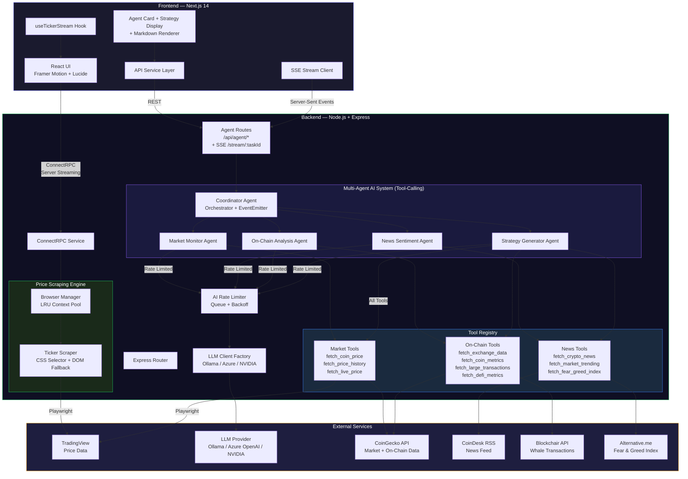
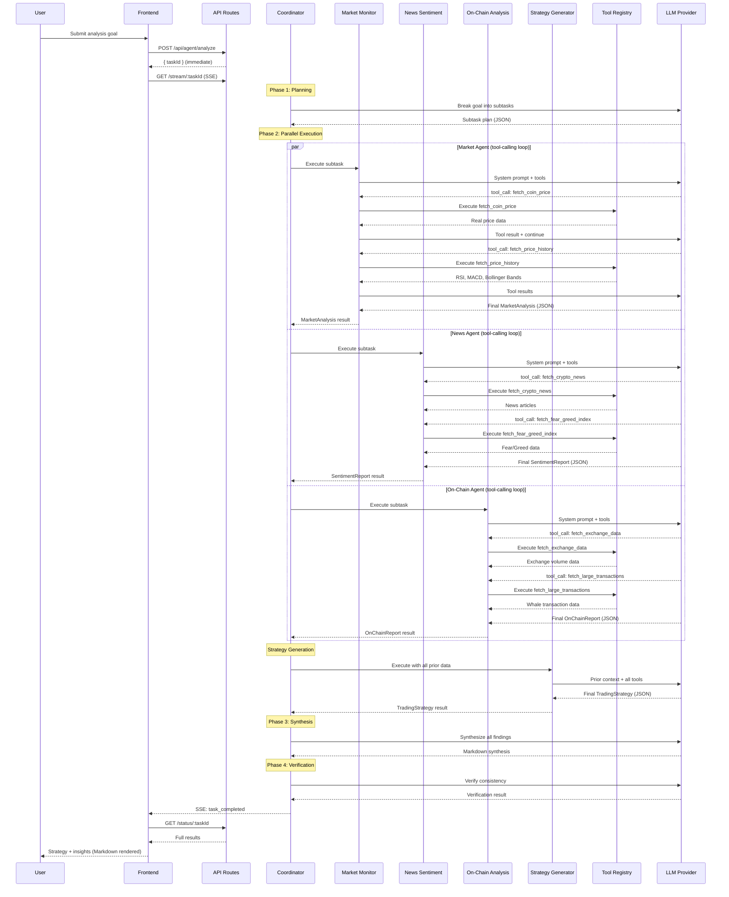
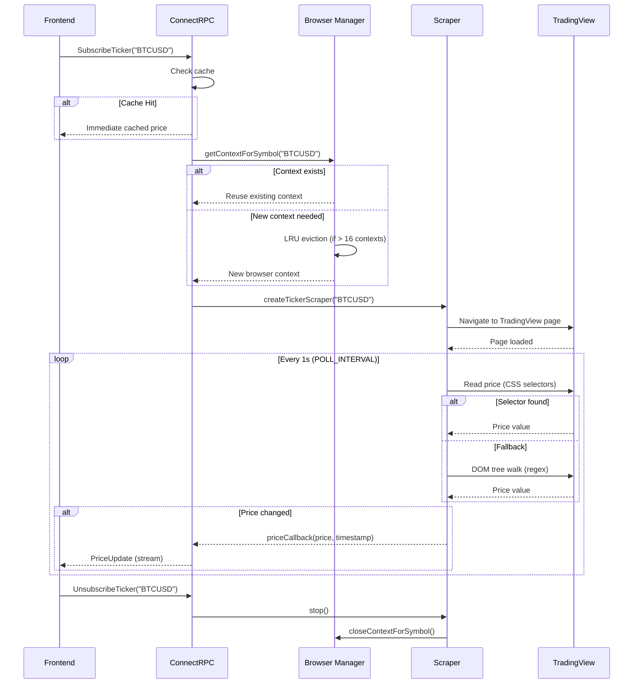
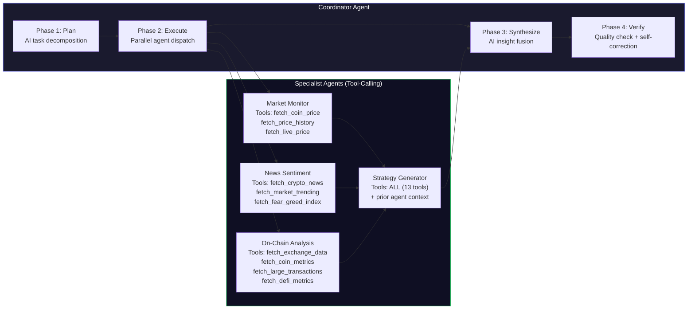

<div align="center">

# CryptoNexus

### AI-Powered Multi-Agent Cryptocurrency Intelligence & Real-Time Streaming Platform

[](https://www.typescriptlang.org/)
[](https://nextjs.org/)
[](https://nodejs.org/)
[](https://playwright.dev/)
[](LICENSE)

A full-stack platform that combines **real-time cryptocurrency price streaming** via TradingView scraping with a **multi-agent AI analysis system** using tool-calling agents. Supports **Ollama** (local), **Azure OpenAI**, and **NVIDIA Nemotron** as LLM providers. Get live prices, market analysis, sentiment reports, on-chain intelligence, and AI-generated trading strategies — all in one place.

</div>

---

## System Architecture

### High-Level Overview



### Multi-Agent AI Pipeline



### Real-Time Price Streaming Flow



---

## Key Features

| Feature | Description |
|---------|-------------|
| **Real-Time Streaming** | Live crypto prices via ConnectRPC server streaming from TradingView |
| **Multi-Agent AI with Tool Calling** | Agents use OpenAI function-calling to invoke real data tools autonomously |
| **Multi-Provider LLM Support** | Switch between Ollama (local), Azure OpenAI, or NVIDIA via env var |
| **Parallel Agent Execution** | Market, sentiment, and on-chain agents run concurrently |
| **13 Data Tools** | Real API integrations — CoinGecko, CoinDesk, Blockchair, Fear & Greed Index |
| **Real Technical Indicators** | RSI, MACD, SMA, EMA, Bollinger Bands calculated from actual historical data |
| **SSE Progress Streaming** | Real-time tool call activity and agent progress via Server-Sent Events |
| **Markdown Rendering** | AI synthesis and strategy reasoning rendered with full markdown support |
| **Self-Correction** | Coordinator retries failed agents and adjusts plans mid-execution |
| **Non-Blocking API** | `/analyze` returns immediately; task runs in background |

---

## Tech Stack

### Frontend
| Technology | Purpose |
|------------|---------|
| **Next.js 14** | React framework with SSR/SSG |
| **React 18** | Component UI with hooks |
| **ConnectRPC (Web)** | Type-safe server streaming |
| **Framer Motion** | Animations & transitions |
| **react-markdown + remark-gfm** | Markdown rendering for AI outputs |
| **Recharts** | Data visualization charts |
| **Lucide React** | Icon library |

### Backend
| Technology | Purpose |
|------------|---------|
| **Node.js + Express** | HTTP server & routing |
| **ConnectRPC** | gRPC-like RPC framework |
| **Playwright** | Headless browser automation |
| **OpenAI SDK** | LLM integration (Ollama / Azure / NVIDIA) |
| **Tool-calling agent loop** | ReAct pattern with function calling |
| **Axios** | HTTP client for external APIs |

### Infrastructure
| Technology | Purpose |
|------------|---------|
| **Protocol Buffers** | Service/message definitions |
| **pnpm Workspaces** | Monorepo package management |
| **PostgreSQL** | Persistent data storage |
| **Redis** | Caching layer |
| **TypeScript** | End-to-end type safety |

---

## Project Structure

```
CryptoNexus/
├── frontend/                          # Next.js 14 frontend
│   ├── src/
│   │   ├── components/
│   │   │   ├── AddTickerForm.tsx       # Ticker subscription form
│   │   │   ├── AgentCard.tsx           # AI agent task visualization
│   │   │   ├── Markdown.tsx            # Themed markdown renderer
│   │   │   ├── StrategyDisplay.tsx     # Trading strategy results UI
│   │   │   ├── ThemeToggle.tsx         # Dark/light mode toggle
│   │   │   └── TickerList.tsx          # Live price ticker cards
│   │   ├── contexts/
│   │   │   └── ThemeContext.tsx         # Theme provider
│   │   ├── hooks/
│   │   │   └── useTickerStream.ts      # ConnectRPC streaming hook
│   │   ├── lib/
│   │   │   └── api.ts                  # REST + SSE client
│   │   ├── pages/
│   │   │   ├── index.tsx               # Home — analysis launcher
│   │   │   └── analysis/
│   │   │       └── [taskId].tsx        # Live analysis dashboard + tool activity
│   │   ├── styles/                     # Global CSS
│   │   └── types/
│   │       └── agent.types.ts          # Shared agent + SSE event types
│   └── gen/proto/                      # Generated ConnectRPC stubs
│
├── backend/                            # Node.js backend server
│   ├── src/
│   │   ├── agents/
│   │   │   ├── CoordinatorAgent.ts     # Orchestrator (planning, parallel dispatch, synthesis, verification)
│   │   │   ├── MarketMonitorAgent.ts   # Price + technical analysis (tool-calling)
│   │   │   ├── NewsSentimentAgent.ts   # News + sentiment analysis (tool-calling)
│   │   │   ├── OnChainAnalysisAgent.ts # Exchange flows + whale tracking (tool-calling)
│   │   │   └── StrategyGeneratorAgent.ts # Trading strategy synthesis (tool-calling, all tools)
│   │   ├── tools/
│   │   │   ├── types.ts               # ToolDefinition, ToolCallRecord, AgentLoopResult
│   │   │   ├── runner.ts              # ReAct agent loop (LLM ↔ tool execution)
│   │   │   ├── market.tools.ts        # fetch_coin_price, fetch_price_history, fetch_live_price
│   │   │   ├── news.tools.ts          # fetch_crypto_news, fetch_market_trending, fetch_fear_greed_index
│   │   │   ├── onchain.tools.ts       # fetch_exchange_data, fetch_coin_metrics, fetch_large_transactions, fetch_defi_metrics
│   │   │   └── index.ts              # Tool exports
│   │   ├── playwright/
│   │   │   ├── browserManager.ts       # Shared browser + LRU context pool
│   │   │   └── scraper.ts             # TradingView price scraper
│   │   ├── services/
│   │   │   └── connectRpcService.ts    # ConnectRPC streaming service
│   │   ├── routes/
│   │   │   └── agent.routes.ts         # REST + SSE endpoints
│   │   ├── config/
│   │   │   ├── constants.ts            # All configuration constants
│   │   │   └── llmClient.ts           # LLM client factory (Ollama / Azure / NVIDIA)
│   │   ├── types/
│   │   │   └── agent.types.ts          # Agent type definitions
│   │   ├── utils/
│   │   │   ├── rateLimiter.ts          # AI API rate limiter
│   │   │   └── symbols.ts             # Shared crypto symbol utilities
│   │   ├── server.ts                   # Express + middleware setup
│   │   └── index.ts                    # Entry point + logging
│   └── gen/proto/                      # Generated ConnectRPC stubs
│
├── proto/
│   └── ticker.proto                    # Service & message definitions
├── shared/
│   └── types.ts                        # Shared TypeScript types
├── buf.gen.yaml                        # Protobuf code generation config
├── pnpm-workspace.yaml                 # Monorepo workspace config
└── package.json                        # Root workspace scripts
```

---

## Agent System Deep Dive

### Tool-Calling Architecture

Each agent runs a **ReAct loop** powered by OpenAI function calling:

1. The agent sends its system prompt + user task + available tool definitions to the LLM
2. The LLM responds with `tool_calls` (e.g., `fetch_coin_price({ symbol: "BTC" })`)
3. The runner executes the tool and feeds the result back to the LLM
4. The LLM decides to call more tools or produce a final answer
5. Max 10 iterations per agent run



### Available Tools (13 total)

| Tool | Domain | Data Source | Returns |
|------|--------|------------|---------|
| `fetch_coin_price` | Market | CoinGecko | Current price, 24h/7d/30d change, volume, market cap, ATH |
| `fetch_price_history` | Market | CoinGecko | Historical OHLCV + calculated RSI, MACD, SMA, EMA, Bollinger Bands |
| `fetch_live_price` | Market | TradingView (Playwright) | Real-time scraped price |
| `fetch_crypto_news` | News | CoinDesk RSS + CoinGecko | Latest headlines with sources and dates |
| `fetch_market_trending` | News | CoinGecko | Trending coins + global market metrics |
| `fetch_fear_greed_index` | News | Alternative.me | Fear & Greed Index with history |
| `fetch_exchange_data` | On-Chain | CoinGecko | Exchange volume distribution, bid/ask spreads |
| `fetch_coin_metrics` | On-Chain | CoinGecko | Supply, developer activity, community size, sentiment |
| `fetch_large_transactions` | On-Chain | Blockchair | Recent whale transactions (BTC/ETH) |
| `fetch_defi_metrics` | On-Chain | CoinGecko | Global DeFi TVL, dominance, top protocols |

### Self-Correction Loop

The Coordinator implements a self-correction mechanism:
1. After parallel execution, it checks how many tasks **failed**
2. If all fail, the task aborts with an error
3. If some fail, it **retries failed tasks** up to `MAX_SELF_CORRECTION_ATTEMPTS` (default: 3)
4. **Checkpoints** are saved at key transitions for long-running tasks

---

## LLM Provider Configuration

CryptoNexus supports three LLM providers. Set `LLM_PROVIDER` in `backend/.env` to switch:

### Ollama (Local)

Run models locally with zero API costs. Requires [Ollama](https://ollama.com/) installed.

```env
LLM_PROVIDER=ollama
OLLAMA_BASE_URL=http://localhost:11434/v1
OLLAMA_MODEL=mistral:7b
```

```bash
# Pull and run a model
ollama pull mistral:7b
ollama serve
```

Recommended models for tool calling: `mistral:7b`, `llama3.1:8b`, `qwen2.5:14b`

### Azure OpenAI

Use Azure-deployed models like GPT-4.1, GPT-4o, etc.

```env
LLM_PROVIDER=azure
AZURE_ENDPOINT=https://your-resource.openai.azure.com/
AZURE_API_KEY=your-azure-api-key
AZURE_API_VERSION=2024-12-01-preview
AZURE_DEPLOYMENT_NAME=gpt-4.1
```

The `AZURE_DEPLOYMENT_NAME` must match the exact deployment name from your Azure Portal (Azure OpenAI > Model deployments).

### NVIDIA Nemotron

Use NVIDIA's hosted Nemotron models via [build.nvidia.com](https://build.nvidia.com/).

```env
LLM_PROVIDER=nvidia
NVIDIA_API_KEY=your-nvidia-api-key
NVIDIA_BASE_URL=https://integrate.api.nvidia.com/v1
NVIDIA_MODEL=nvidia/nvidia-nemotron-nano-9b-v2
```

### Additional LLM Settings

```env
LLM_MAX_TOKENS=2048        # Max tokens per LLM response
LLM_TEMPERATURE=0.6        # Response creativity (0.0 - 1.0)
```

---

## Getting Started

### Prerequisites

- **Node.js** v18+
- **pnpm** package manager
- **One of**: Ollama installed locally, Azure OpenAI API key, or NVIDIA API key
- **Playwright browsers** installed (for price scraping)

### Installation

```bash
# 1. Clone the repository
git clone <repository-url>
cd CryptoNexus

# 2. Install dependencies
pnpm install --recursive

# 3. Install Playwright browsers
pnpm exec playwright install chromium

# 4. Generate protocol buffer code
buf generate

# 5. Configure environment variables
cp backend/.env.example backend/.env
# Edit backend/.env — set LLM_PROVIDER and the corresponding credentials
```

### Environment Variables

Create a `backend/.env` file (see `backend/.env.example` for all options):

```env
# Server
PORT=4000
HOST=localhost

# LLM Provider — choose one: "ollama", "azure", or "nvidia"
LLM_PROVIDER=ollama
OLLAMA_MODEL=mistral:7b

# TradingView Scraping
POLL_INTERVAL=1000
PAGE_LOAD_TIMEOUT=30000
DEFAULT_EXCHANGE=BINANCE

# Agent Configuration
MAX_SELF_CORRECTION_ATTEMPTS=3
```

### Running the Application

```bash
# Start both frontend and backend
pnpm start

# Or start individually:
cd backend && pnpm dev     # Backend on http://localhost:4000
cd frontend && pnpm dev    # Frontend on http://localhost:3000
```

### Verify Setup

| Endpoint | Purpose |
|----------|---------|
| `http://localhost:3000` | Frontend UI |
| `http://localhost:4000/health` | Backend health check |
| `http://localhost:4000/api/stats` | ConnectRPC stats |
| `http://localhost:4000/api/agent/test` | Agent system status + features |

---

## API Reference

### Real-Time Streaming (ConnectRPC / Protobuf)

```protobuf
service TickerService {
  rpc SubscribeTicker (TickerRequest) returns (stream PriceUpdate);
  rpc UnsubscribeTicker (TickerRequest) returns (PriceUpdate);
}
```

### Agent REST API

| Method | Endpoint | Description | Body |
|--------|----------|-------------|------|
| `POST` | `/api/agent/analyze` | Start analysis (returns immediately) | `{ "goal": "Analyze Bitcoin..." }` |
| `GET` | `/api/agent/status/:taskId` | Get task progress + results | — |
| `GET` | `/api/agent/stream/:taskId` | SSE stream for real-time progress | — |
| `GET` | `/api/agent/test` | Health check + feature list | — |

<details>
<summary>Example: Start Analysis</summary>

```bash
curl -X POST http://localhost:4000/api/agent/analyze \
  -H "Content-Type: application/json" \
  -d '{"goal": "Analyze Bitcoin for trading opportunities"}'
```

**Response (immediate):**
```json
{
  "success": true,
  "taskId": "faacef28-e9c4-43d9-9bb0-cb910bf0f2ec",
  "status": "planning",
  "message": "Analysis task started. Use /status/:taskId or /stream/:taskId to monitor progress."
}
```
</details>

<details>
<summary>Example: Stream Progress (SSE)</summary>

```bash
curl -N http://localhost:4000/api/agent/stream/faacef28-e9c4-43d9-9bb0-cb910bf0f2ec
```

**Events:**
```
event: task_started
data: {"taskId":"faacef28-...","event":"task_started","status":"planning"}

event: subtask_started
data: {"taskId":"faacef28-...","event":"subtask_started","subtaskId":"...","agentType":"market_monitor"}

event: tool_call
data: {"taskId":"faacef28-...","event":"tool_call","toolName":"fetch_coin_price","durationMs":1200}

event: subtask_completed
data: {"taskId":"faacef28-...","event":"subtask_completed","subtaskId":"..."}

event: task_completed
data: {"taskId":"faacef28-...","event":"task_completed","status":"completed"}

event: done
data: {"taskId":"faacef28-..."}
```
</details>

<details>
<summary>Example: Check Status</summary>

```bash
curl http://localhost:4000/api/agent/status/faacef28-e9c4-43d9-9bb0-cb910bf0f2ec
```

**Response:**
```json
{
  "taskId": "faacef28-...",
  "goal": "Analyze Bitcoin for trading opportunities",
  "status": "completed",
  "progress": { "completed": 4, "total": 4, "percentage": 100 },
  "duration": "1m 23s",
  "subtasks": [
    { "name": "BTC Market Analysis", "status": "completed", "agentType": "market_monitor", "result": { "currentPrice": 67500, "..." : "..." } },
    { "name": "BTC News & Sentiment", "status": "completed", "agentType": "news_sentiment", "result": { "overallSentiment": "bullish", "..." : "..." } },
    { "name": "BTC On-Chain Analysis", "status": "completed", "agentType": "onchain_analysis", "result": { "..." : "..." } },
    { "name": "BTC Trading Strategy", "status": "completed", "agentType": "strategy_generator", "result": { "recommendation": "BUY", "confidence": 0.72, "..." : "..." } }
  ],
  "result": {
    "synthesis": "## Key Findings\n\n...",
    "verification": { "isValid": true, "confidenceScore": 0.85, "issues": [], "recommendations": [] }
  }
}
```
</details>

---

## Key Technical Decisions

### Why Tool-Calling Agents?
- **LLM decides what data to fetch** — no hardcoded data pipeline
- **Real data only** — every number comes from an actual API, no `Math.random()`
- **Extensible** — add a new tool and the LLM can immediately use it
- **Observable** — every tool call is recorded with timing and arguments

### Why Multi-Provider LLM Support?
- **Ollama** — free local inference, no API keys, works offline
- **Azure OpenAI** — enterprise-grade GPT models with SLA
- **NVIDIA** — cost-effective high-quality reasoning
- Switch with a single env var change, no code changes needed

### Why ConnectRPC over WebSockets?
- **Type-safe streaming** via Protocol Buffers — no manual serialization
- **HTTP/2 compatible** — works with standard infrastructure
- **Auto-generated client code** — frontend and backend always in sync

### Why Playwright over REST APIs for Prices?
- **No API key required** for TradingView price data
- **Full browser context** — handles JavaScript-rendered content
- **LRU browser context pool** — efficient resource sharing across symbols

### Why Parallel Agent Execution?
- Market, sentiment, and on-chain analysis are **independent** data sources
- Running them concurrently cuts total analysis time by ~3x
- Strategy agent runs last since it depends on all collected data

---

## Monitoring & Observability

- **Health Check**: `GET /health` — basic service status
- **Stats**: `GET /api/stats` — active connections, scrapers, client count
- **SSE Streaming**: `GET /api/agent/stream/:taskId` — real-time tool calls and agent progress
- **Structured Logging**: Run-specific log directories under `backend/logs/`
- **Agent Status**: Full task state via polling or SSE
- **Startup Banner**: Shows active LLM provider, model, and base URL

---

## Contributing

1. Fork the repository
2. Create a feature branch: `git checkout -b feature/your-feature`
3. Commit changes: `git commit -am 'Add your feature'`
4. Push to branch: `git push origin feature/your-feature`
5. Submit a pull request

---

## License

This project is open source and available under the [MIT License](LICENSE).

---

## Acknowledgments

- **[TradingView](https://www.tradingview.com/)** — Real-time cryptocurrency price data
- **[CoinGecko](https://www.coingecko.com/)** — Market data, on-chain metrics, trending coins
- **[Ollama](https://ollama.com/)** — Local LLM inference
- **[Azure OpenAI](https://azure.microsoft.com/en-us/products/ai-services/openai-service)** — Enterprise LLM hosting
- **[Playwright](https://playwright.dev/)** — Reliable browser automation
- **[ConnectRPC](https://connectrpc.com/)** — Efficient real-time communication
- **[Next.js](https://nextjs.org/)** — Modern React framework
